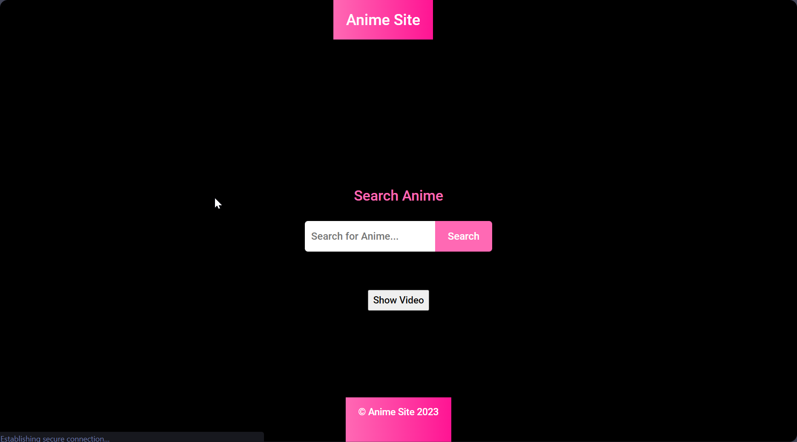

# Test-Anime-Site

  

## Explore Your Favorite Anime

  <a href="https://animegamer4422.github.io/Test-Anime-Site/" style="font-size: 24px; font-weight: bold; text-decoration: none;">
    Check it out!
  </a>

Anime Site is a website where you can easily find and watch your favorite anime series. We built it using HTML, CSS, and JavaScript, and it uses the Consumet API to get all the anime information and images.

## Sneak Peek

- **Screenshot-1**
  

- **Screenshot-2**
  

- **Screenshot-3**
  

- **Screenshot-4**
  

## Features

- Easily search for anime series by name
- Responsive design that adapts to different screen sizes (works on computers, tablets, and phones size screen)
- Enjoy watching anime with a cool video player

## Get Started

To try Anime Site on your computer, follow these steps:

1. Click the green "Code" button, then select "Download ZIP."
2. Open the downloaded folder and find the `index.html` file. Double-click to open it in your web browser.

## How to Use 

Looking for your favorite anime? Just type the name in the search box and click "Search." You'll see a grid of images for matching series. Click "Show Video" to start watching.

## What We Used 

- [Plyr](https://plyr.io/): A simple media player for watching anime; it's accessible and customizable HTML5 media player
- [Consumet API](https://docs.consumet.org/): An API for fetching anime information and images

## Contribution

Excited to contribute? We'd love your help! If you have ideas, found a bug, or want to request a feature, let us know by opening an issue or sending a pull request.

## License

This project is licensed under the [MIT License](https://choosealicense.com/licenses/mit/). Check out the [LICENSE](LICENSE) file for more details.
